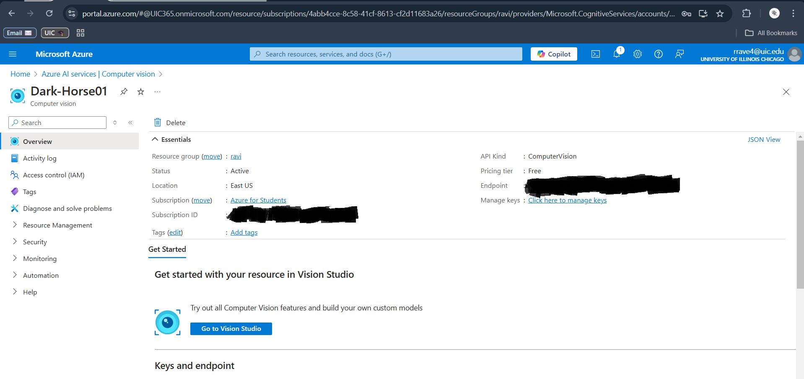
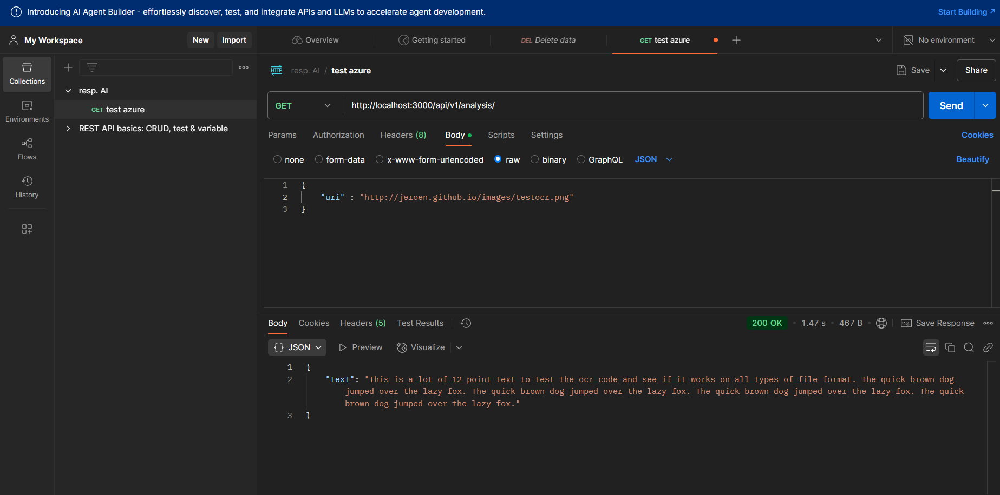
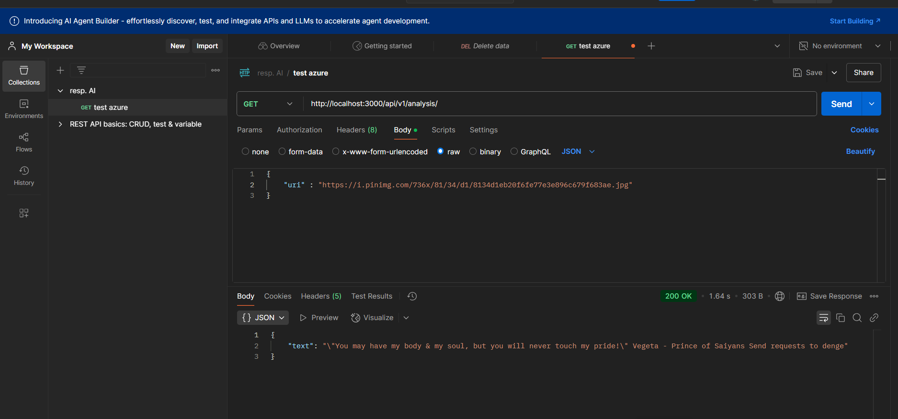

# Deliverables Overview - Ravi Teja Ravella

## 1. Creating Account and Connecting to Azure Vision API:

---

## 2. Explaining Why Hard Coding Credentials Is a Bad Idea

*Answer:*  
Hard-coding credentials in code is risky because it exposes sensitive information directly, making it easy for others to misuse if the code gets shared or pushed to a public repository. This could lead to unauthorized access, data breaches, or even financial loss. It’s also a hassle to update or rotate credentials since it requires changes to the code every time. To avoid these problems, I make sure to store credentials securely using environment variables, encrypted files, or secret management tools. This keeps them safe and makes managing them much easier without compromising security.

The most common and well-known way to secure credentials is to keep them in a .env file for local usage (I have used config.json file. This acts the same as .env file). This environment file contains environment variables.

The changes that have been made are:

-Added pip install python-dotenv to requirements.txt

-Removed the hard coded variables in analyze.py

-Added a new config.json file (.env file can also be used) where the user's credentials can be stored (don't forget to use your own credentials buddy), and made sure this isn't committed to GitHub. To ensure this file isn’t committed to GitHub, inlcude the file in .gitignore. It is very important to double-check that this has been done.

-In the file, you got to declare the variables like below:

  ## *If using .env file*
  
  Endpoint="Your_Azure_API_Endpoint" 
  
  Key="Your_API_Key"

  ## *If using a .json file*
  
  {
  
    Endpoint:"Your_Azure_API_Endpoint",
    
    Key:"Your_API_Key"
    
  }

---

## 3. Run the API Endpoint with the Starter Code Using Postman:

This is the given picture and the text extracted from it can be seen below. This is done using Postman.

  

Let's try a different image in which the text is not that clear.

  

You see it works fine with very less error. And if you see, it also captures very minute detail of the text "send request to....".

# Lab 1: Calling, Building, and Securing APIs
In homework I1 you will use third-party machine learning APIs and in the group project you will develop your own APIs. In this lab, you will experiment with both, connecting to the Azure Vision API and providing your own API endpoint. 
To receive credit for this lab, show your work to the TA during recitation.

## Deliverables
- [ ] Create an account and connect to the Azure Vision API
- [ ] Explain to the TA why hard-coding credentials is a bad idea. Commit your code to GitHub without committing your credentials.
- [ ] Run the API endpoint with the starter code and demonstrate that it works with an example invocation (e.g., using curl).

## Getting started
Clone the starter code from this Git repository

The code implements a flask web application that receives API requests to analyze an image and return information about the image, including the text contained within. To identify the text, the OCR feature of the Azure Vision API [[documentation](https://westcentralus.dev.cognitive.microsoft.com/docs/services/computer-vision-v3-2/operations/56f91f2e778daf14a499f20d#:~:text=test.jpg%22%7D-,Response%20200,-The%20OCR%20results), [response format](https://westcentralus.dev.cognitive.microsoft.com/docs/services/computer-vision-v3-2/operations/56f91f2e778daf14a499f20d#:~:text=test.jpg%22%7D-,Response%20200,-The%20OCR%20results)] can be used by adjusting the API endpoint and credentials in the code. We use the Azure’s provided libraries to abstract from low-level protocol details.

Install the dependencies in the `requirements.txt` file with pip or similar. Replace Endpoint and Key with your own in [analyze.py](https://github.com/eshetty/mlip-api-lab/blob/main/analyze.py). To set up the flask server, just run `python3 app.py`. The system should try to analyze an example image and report the results when you go to http://localhost:3000/

## Connecting to the Azure Vision API
1. Sign up for the a student account for Microsoft Azure: https://azure.microsoft.com/en-us/free/students/ – no credit card required

2. Create an instance of the Computer Vision service and get an API endpoint of your instance of the service.

3. Get a subscription key to authorize your script to call the Computer Vision API.

4. Update the code with the endpoint and key and test it.

## Secure your Credentials
The starter code hardcodes credentials in the code. This is a bad practice. 

Research and discuss best practices, such as never hard-code credentials, never commit credentials to Git, rotate secrets regularly, encrypt your secrets at rest/in-transit if possible, practice least-access privilege on machines where your credentials are stored as environment variables or within local files.

Rewrite the code to load credentials from a file or an environment variable and commit the code without the credentials to GitHub.

## Calling your own API
The starter code comes with a flask server that serves the website at http://localhost:3000/ but also exposes an own API at http://localhost:3000/api/v1/analysis/ accepting a GET request with a JSON object with a single field “uri” pointing to an image to analyze.

Identify how to call your own API with a tool like [curl](https://curl.se/docs/manpage.html) or [Postman](https://www.postman.com).

Optionally extend the API or document it with [Swagger](https://swagger.io).

## Additional resources 
- [Redhat article on API](https://www.redhat.com/en/topics/api/what-are-application-programming-interfaces)
- [Azure Computer Vision](https://learn.microcsoft.com/en-us/python/api/overview/azure/cognitiveservices-vision-computervision-readme?view=azure-python)
- [API Design Best Practices](https://blog.stoplight.io/crud-api-design?_ga=2.223919515.1813989671.1674077556-1488117179.1674077556)
- [API Endpoint Best Practices](https://www.telerik.com/blogs/7-tips-building-good-web-api)
- The file seai-azure-cv-ocr-api.json has the structure to test calls to the Azure Vision API with Postman.

